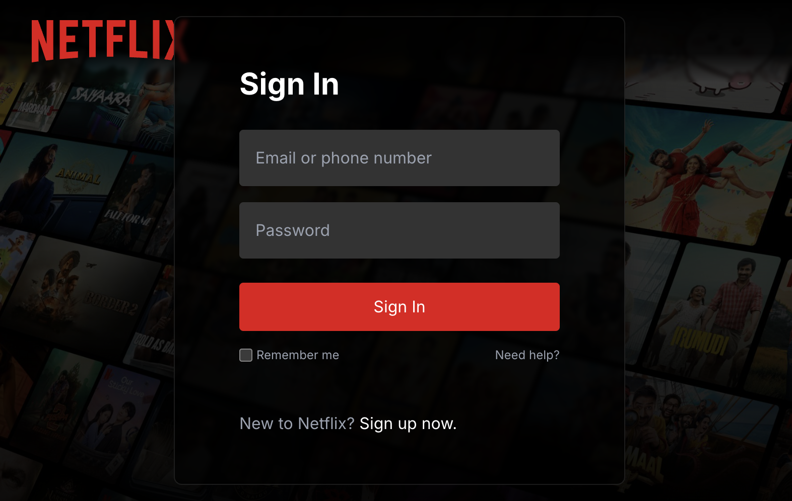

# NetflixGPT

NetflixGPT is a React movie-discovery app with a Netflix-inspired interface. Browse popular and top-rated titles, watch trailers, and use Gemini-powered search to get movie suggestions.

## Screenshot



## Features

- Email and password sign-in with Firebase Authentication
- Browse now-playing, popular, and top-rated movies
- View movie details and trailer previews
- Search for movie recommendations with Gemini
- English and Hindi options for GPT search

## Getting started

### Requirements

- Node.js and npm
- A Gemini API key for GPT movie search

### Install and run

```bash
cd frontend
npm install
cp .env.example .env
```

Add your Gemini API key to `frontend/.env`:

```env
REACT_APP_GEMINI_API_KEY=your_gemini_api_key
```

Start the development server:

```bash
npm start
```

The app opens at [http://localhost:3000](http://localhost:3000). To create a production build, run `npm run build` from `frontend/`.

Firebase Authentication and TMDB are also used by the app; configure those services with your own project credentials before deploying.

## Project structure

```text
NetflixGpt/
├── .gitignore
├── README.md
└── frontend/
    ├── .env.example
    ├── package.json
    ├── public/
    │   ├── index.html
    │   └── screenshot.png
    └── src/
        ├── components/       # Sign-in, browsing, movie lists, and GPT search UI
        ├── hooks/            # Movie and trailer data hooks
        ├── utils/
        │   ├── __redux_store__/ # Redux store and slices
        │   ├── constants.js
        │   ├── firebase.js
        │   └── language.js
        ├── App.js
        ├── index.css
        └── index.js
```

## Available scripts

Run these from `frontend/`:

| Command | Description |
| --- | --- |
| `npm start` | Start the development server |
| `npm test` | Run tests |
| `npm run build` | Build the app for production |
